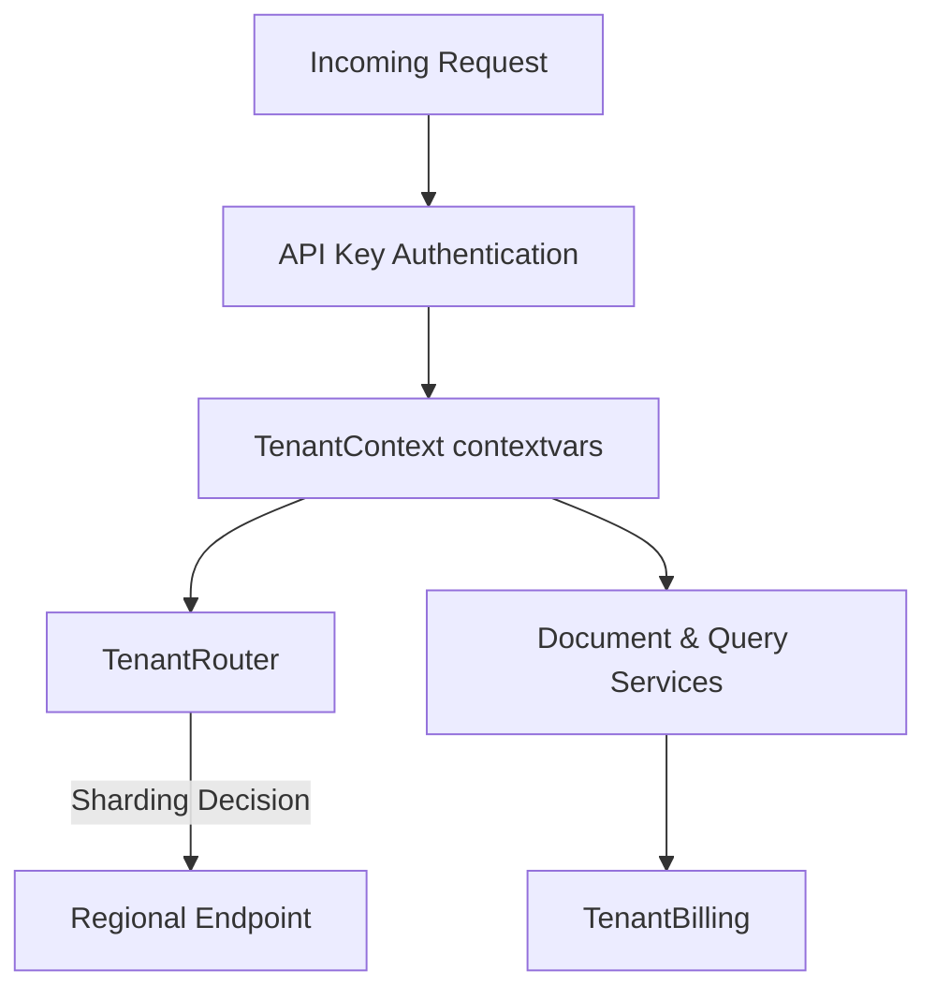

# Multi-Tenancy Support

This module implements complete multi-tenancy isolation, region/load request routing, billing, usage recording, and administrative endpoints for **AMDI-OS**.

---

## Architecture Overview



The system is composed of:
1. **`TenantManager`**: Handles tenant CRUD, plans (`free`, `starter`, `professional`, `enterprise`, `custom`), lifecycle statuses (`active`, `suspended`, `trial`, `cancelled`, `pending`), and API key rotation.
2. **`TenantContext`**: Thread-safe and async-safe context managers wrapping contextvars for request isolation.
3. **`TenantRouter`**: Routes requests to appropriate regional sharded endpoints based on latency, load, region cost factor, or sticky session caching.
4. **`TenantBilling`**: Trackable usage metrics recording (documents processed, query volume, tokens, storage size-hours) and automated monthly invoice generation.
5. **`tenant_admin.py`**: APIRouter exposing management endpoints for tenant administration.

---

## Usage Examples

### 1. Request Isolation Context
Wrap any execution block with `set_current_tenant` to assign per-tenant contextvars:
```python
from backend.src.multitenancy import set_current_tenant, get_current_tenant

# Start context scope
with set_current_tenant(tenant_id="tenant_123", config={"db_shard": "shard_a"}):
    # Inside this block, get_current_tenant() is fully isolated and thread/async safe
    print(get_current_tenant())  # "tenant_123"

# Scope is restored automatically on exit
```

### 2. Usage Tracking and Invoicing
Record usage metrics during execution:
```python
from backend.src.multitenancy import TenantBilling, UsageMetric, TenantManager

manager = TenantManager()
billing = TenantBilling()

# Register tenant
tenant = manager.create_tenant(name="Acme Corp", plan=TenantPlan.STARTER)

# Record usage
billing.record(tenant_id=tenant.tenant_id, metric=UsageMetric.DOCUMENTS_PROCESSED, quantity=5)
billing.record(tenant_id=tenant.tenant_id, metric=UsageMetric.QUERIES, quantity=250)

# Generate invoice at end of month
invoice = billing.generate_invoice(tenant_id=tenant.tenant_id, tenant_manager=manager)
print(invoice.to_dict())
```
