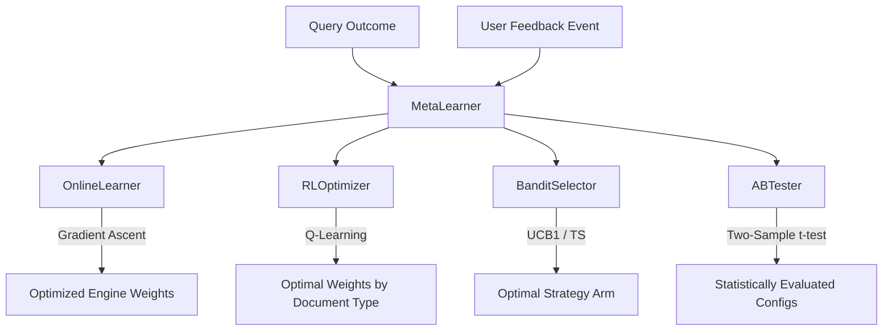

# Wave 5 Meta Learning Engine

This module implements the Meta Learning Engine for **AMDI-OS**, enabling continuous weight optimization across mathematical representation engines and query strategies.

---

## Architecture Overview



The engine is composed of 6 main parts:
1. **`MetaLearner`**: Main orchestrator.
2. **`OnlineLearner`**: Continuous gradient updates using query logs.
3. **`RLOptimizer`**: Reinforcement learning (tabular Q-learning with experience replay) from user feedback to learn optimal weights per document type.
4. **`FeedbackLoop`**: Collects and structures explicit (star ratings, thumbs) and implicit (dwell time, clicks, copies) user feedback.
5. **`BanditSelector`**: Multi-armed bandit selector implementing UCB1, Thompson Sampling, and Epsilon-Greedy policies to balance exploration and exploitation of strategy variants.
6. **`ABTester`**: Running A/B tests on weight strategies, with two-sample t-test evaluation to promote winning configurations.

---

## Mathematical Foundations

### 1. Online Learner (Gradient Ascent)
Updates weights incrementally as new feedback arrives:
\[w_{t+1} = \text{renormalize}(w_t + \eta \cdot \nabla L(w_t, \text{feedback}))\]
Where:
- \(\eta\) is the learning rate.
- The loss gradient \(\nabla L\) is computed via reward prediction error: \(\nabla L_i = -(1.0 - R) \cdot w_i\) (penalizing engines in proportion to their weight when error is high).

### 2. Reinforcement Learning (Q-learning)
Discretizes weight states and updates the action value function \(Q(s, a)\):
\[Q(s, a) \leftarrow Q(s, a) + \alpha \cdot \left( R + \gamma \cdot \max_{a'} Q(s', a') - Q(s, a) \right)\]
Where:
- State \(s\) is a tuple of `(document_type, discretized_weights)`.
- Action \(a\) adjusts a specific engine's weight by a delta \(\pm 0.01\).
- Experience Replay samples mini-batches from a buffer to perform experience replay updates and stabilize learning.

### 3. Multi-Armed Bandit

#### UCB1 (Upper Confidence Bound)
Selects the arm \(a\) maximizing:
\[UCB(a) = Q(a) + c \cdot \sqrt{\frac{\log(t)}{N(a)}}\]
Where \(t\) is total pulls, \(N(a)\) is pulls for arm \(a\), and \(c\) is the exploration constant (default \(\sqrt{2}\)).

#### Thompson Sampling (Beta-Bernoulli)
Samples from the Beta posterior distribution for each arm \(a\):
\[\theta_a \sim \text{Beta}(\alpha_a, \beta_a)\]
Selects the arm with the highest sample value.

### 4. A/B Tester (Two-Sample t-Test)
Calculates statistical significance between control and treatment variants:
\[t = \frac{\mu_1 - \mu_2}{\sqrt{s_p^2 \left( \frac{1}{n_1} + \frac{1}{n_2} \right)}}\]
Where \(s_p^2\) is the pooled variance:
\[s_p^2 = \frac{(n_1 - 1)s_1^2 + (n_2 - 1)s_2^2}{n_1 + n_2 - 2}\]
We compute the two-tailed \(p\)-value utilizing standard normal CDF approximation.

---

## Usage Example

```python
from backend.src.optimization.meta_learning import MetaLearner, MetaLearningConfig, FeedbackType

# 1. Initialize Orchestrator
config = MetaLearningConfig(online_learning_rate=0.01)
meta_learner = MetaLearner(config)

# 2. Process query outcome
update_report = meta_learner.process_query_outcome(
    document_type="financial_pdf",
    query="What is the net revenue?",
    accuracy=0.85,
    latency_ms=250.0,
    token_count=850,
)
print("New weights:", meta_learner.get_current_weights())

# 3. Record explicit rating
meta_learner.record_user_feedback(
    user_id="user_123",
    query="What is the net revenue?",
    response="The net revenue is $5.2M.",
    feedback_type=FeedbackType.EXPLICIT_RATING,
    rating=1.0,  # 5-star rating mapped to 1.0
)

# 4. Generate report
report = meta_learner.generate_report()
print("Recommendations:", report.recommendations)
```
