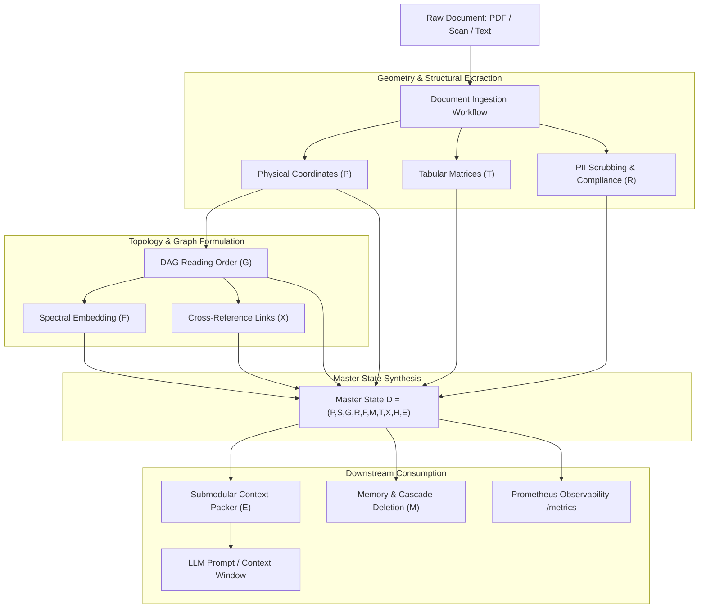

# Architecture & Master State Mathematical Formulation

AEGIS-DocIntel models documents not as unstructured text streams, but as multi-dimensional topological manifolds. The unified representation uniting all engines is the **Master State Tuple $\mathcal{D}$**, formally defined in Phase 5 and implemented in `src/models/master_state.py`.

---

## The Master State Tuple $\mathcal{D}$

The mathematical state of any document processed by AEGIS-DocIntel is represented as:

$$\mathcal{D} = (P, S, G, R, F, M, T, X, H, E)$$

Each component captures a discrete structural dimension:

| Element | Formal Domain | Description & Implementation | Status |
|---|---|---|---|
| **$P$** | Physical Geometry | 2D bounding boxes $(x_0, y_0, x_1, y_1)$, page numbers, font sizes, line heights, and spatial coordinates. Sourced via PDF extraction. | Hardened |
| **$S$** | Semantic Embedding | Contextual dense vector embeddings. Generated via LayoutLM / Sentence-Transformers, with deterministic fallback when ML packages are absent. | Functional (Fallback flag) |
| **$G$** | Reading Graph | Directed Acyclic Graph $(V, E)$ encoding natural reading sequence. Edges derived from vertical overlap, horizontal margins, and multi-column heuristics. | Hardened |
| **$R$** | Redaction Layer | Compliance transformation mapping $R: \text{Text} \to \text{Text}$ with differential audit logs tracking redacted PII spans. | Hardened |
| **$F$** | Fused Representation | Spectral Laplacian embedding fusing spatial adjacency ($P$) with text semantics ($S$) into a lower-dimensional manifold. | Hardened |
| **$M$** | Memory State | Multi-tier cache representation (L1 in-memory LRU, L2 vector store) maintaining document state and lifecycle metadata. | Hardened |
| **$T$** | Tabular Structure | Matrix representation of structured tables, grid lines, merged cells, and headers extracted via PDFPlumber bbox transformations. | Hardened |
| **$X$** | Cross-References | Citation and cross-reference bipartite graph linking in-text references to figures, footnotes, and bibliographic entries. | Hardened |
| **$H$** | Homology Hierarchy | Persistent Homology barcodes and Vietoris-Rips complexes capturing multiscale document topological holes and hierarchy. | Research Target |
| **$E$** | Elastic Chunks | Dynamically sized, semantic-boundary-preserving chunks optimized via submodular knapsack selection for LLM injection. | Hardened |

---

## Architectural Pipeline Flow



---

## Implementation Details

### MasterState Dataclass (`src/models/master_state.py`)

The Master State is instantiated as an immutable, strictly-typed Python dataclass:

```python
from dataclasses import dataclass, field
from typing import Dict, List, Optional, Any

@dataclass(frozen=True)
class MasterState:
    doc_id: str
    physical_layout: List[Dict[str, Any]]      # P
    semantic_vectors: Optional[Any]            # S
    reading_graph: Dict[str, List[str]]        # G
    redaction_manifest: Dict[str, Any]         # R
    spectral_features: Optional[Any]           # F
    memory_status: Dict[str, Any]              # M
    tables: List[Dict[str, Any]]               # T
    cross_references: List[Dict[str, Any]]     # X
    homology_barcode: Optional[Any] = None     # H (Research target)
    elastic_chunks: List[str] = field(default_factory=list) # E
    semantic_status: str = "production"        # Flag: 'production' | 'mock_fallback'
```

### Cascade Deletion Architecture (Phase 11)

When a document $\mathcal{D}$ is purged via `DELETE /v1/documents/{doc_id}`, the storage engine triggers a cascade across all state layers:

1. **Physical & Raw Store**: Local temporary files and PDF artifacts are unlinked.
2. **Tabular & Graph Cache**: In-memory DAG representation and extracted Markdown tables are evicted from the LRU cache.
3. **Vector Indices**: Dense embeddings associated with the `doc_id` chunk partitions are pruned from vector memory.
4. **Audit Log**: A cryptographic deletion certificate is appended to the immutable compliance log.