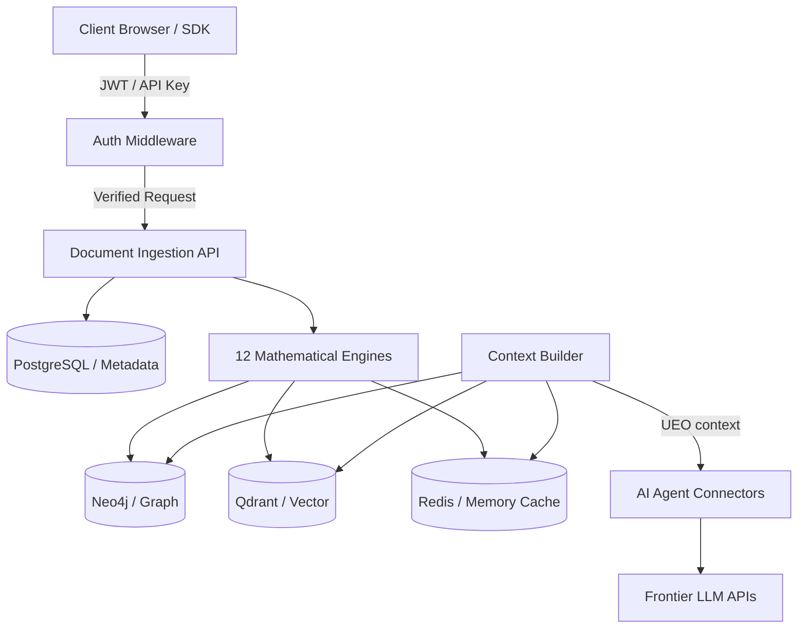

# AMDI-OS Threat Model

This document outlines the threat modeling for AMDI-OS using the **STRIDE** and **DREAD** security frameworks.

---

## 1. System Boundaries & Data Flow

---

## 2. STRIDE Threat Analysis

| Category | Threat | Mitigations |
|----------|--------|-------------|
| **Spoofing** | Unauthorized user spoofing API tokens | Signed JSON Web Tokens (JWT) with HS256 algorithm and periodic key rotation. |
| **Tampering** | Parameter tampering on document upload / extraction | strict validation of document hashes, sanitization of input filenames, file type verification. |
| **Repudiation** | User denies performing actions | Tamper-evident secure audit trail logging all CRUD operations, document uploads, and configuration alterations. |
| **Information Disclosure** | Leakage of tenant-specific data to other tenants | Row-Level Security (RLS) in PostgreSQL, namespace segregation in Qdrant, strict logical isolation checks. |
| **Denial of Service** | Flooding backend with processing requests | Rate-limiting (100 req/min per key), worker queue constraints, memory limits per document processing task. |
| **Elevation of Privilege** | Normal user calling Admin API endpoints | Role-Based Access Control (RBAC) + Attribute-Based Access Control (ABAC) middleware checking claims on every request. |

---

## 3. DREAD Risk Assessment

The DREAD framework evaluates risk across five parameters graded 1-10:
* **D**amage potential
* **R**eproducibility
* **E**xploitability
* **A**ffected users
* **D**iscoverability

### High-Risk Profiles Evaluated
1. **API Key Theft:** Damage (9), Reproducibility (8), Exploitability (7), Affected Users (6), Discoverability (5). **Score: 7.0/10** (Mitigated via IP allowlists + key rotation).
2. **Path Traversal via Document Upload:** Damage (10), Reproducibility (9), Exploitability (9), Affected Users (10), Discoverability (4). **Score: 8.4/10** (Mitigated via path sandboxing).
